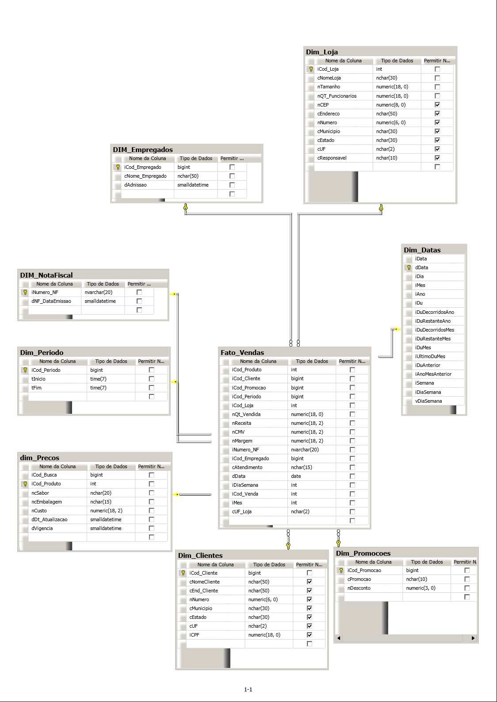

# Criando o Modelo Dimensional da Doce Sweet com SQL

O Modelo tem as seguintes tabelas:

- [Dim_clientes](./scripts/Dim_Clientes.sql)
- [Dim_Datas](./scripts/Dim_Data.sql)
- [Dim_Empregados](./scripts/Dim_Empregados.sql)
- [Dim_Lojas](./scripts/Dim_Lojas.sql)
- [Dim_NotaFiscal](./scripts/Dim_NotaFiscal.sql)
- [Dim_Periodo](./scripts/Dim_Periodo.sql)
- [Dim_Precos](./scripts/Dim_Precos.sql)
- [Dim_Promocoes](./scripts/Dim_Promocoes.sql)
- [Fato_vendas](./scripts/Fato_vendas.sql)

  ## Diagrama
  

### Dica: Criar primeiro a Fato 

Para testar código SQL online, poderá usar o site W3SCHOOLS

[Aqui vai para o Site](https://www.w3schools.com/sql/trysql.asp?filename=trysql_op_in)

### Trata-se de um ambiente online e gratuito para executar consultas online
- Seu uso é bem simples é intuitivo
### Outras ferramentas de apoio

- SQL Developer
- SQL Developer Data Modeler

[Disponíveis aqui](https://docs.oracle.com/en/database/oracle/sql-developer/)
  

